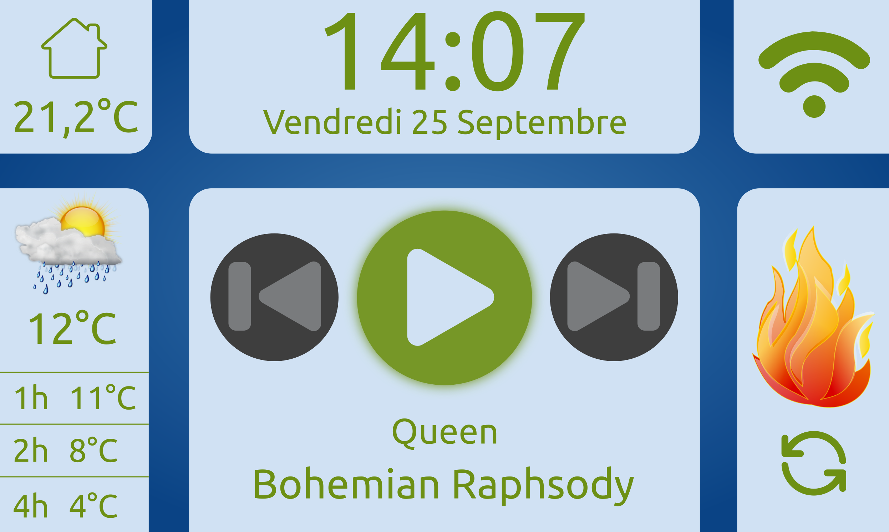

# Domobox project

This project is a home-made domotic solution to drive some devices in my house:

* Pellet stove
* Speakers
* Window shutters

I also added a few everyday features like weather forecast and dynamic wifi connection:

 

It was not originally intended for an open source release, so a lot of things are very specific to my use and setup. I share it in the hope that it may inspire other people or be used as a C++/Qt/QML example base, as it is a simple project.

Some technical details about the physical integration are detailed on my blog, although a bit outdated:

https://pleasefreemymind.blogspot.com/

Feel free to open an issue to ask any question.
